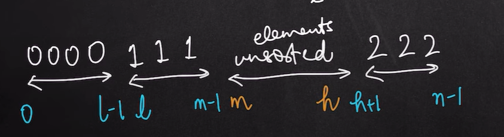

# 75. [Sort Colors](https://leetcode.com/problems/sort-colors/)

## Brute-Force (Optimised)
> O(n)
- Calculated the number of times each element id repeated.
- Iterated through the vector again and then replaced the elements accordingly in a sorted manner.

## DNF Algorithm (Dutch National Flag)
> O(n) - Single Pass
- We take 3 pointers, Low, Mid and High.
- Mid - High is unsorted area.  

- We'll then check the value at mid.
  - `nums[mid] == 0` : swap mid and low and increment both of them.
  - `nums[mid] == 1` : just increment mid.
  - `nums[mid] == 2` : swap mid and high and decrement high.
